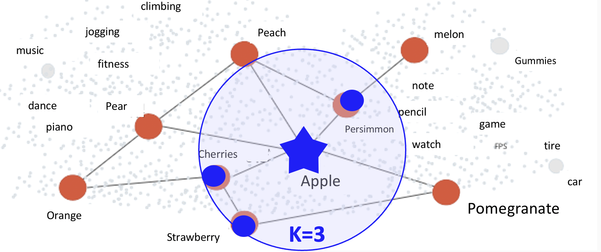

# Let's use the OpenAI Embeddings API and the vector search engine Vald to search for similar sentences!

Hello, this is the ManagedVald team at [LY Corporation](https://www.lycorp.co.jp/en/).

This article introduces an example of using the [OpenAI Embeddings API]((https://platform.openai.com/docs/guides/embeddings)) and the approximate neighborhood vector search engine [Vald](https://vald.vdaas.org) to search for similar sentences, and then explains why it is necessary to use a vector search engine like Vald, along with actual verification results.

The notebook used for the experiment is [here](./embeddings.ipynb).


## Introduction
In recent years, the popularity of generative AI such as GPT has skyrocketed, and the number of services that make use of these technologies is increasing.

However, there are many situations in which it is difficult to adopt generative AI into services because of its tendency to tell plausible lies called "hallucination".

Generative AI consists of the following two steps.
1. understand input sentences, etc., and convert them into vectors
2. generate the next sentence with a high probability

Hallucination is generated by the second step. Therefore, it can be avoided by stopping the process at the first step and effectively utilizing this vector.

Recently, a method called Retrieval Augmented Generation (RAG), which combines generative AI and vector search, is often used to avoid this problem.

In this article, we show how to search for similar sentences using the OpenAI Embeddings API and Vald as an example of effectively utilizing the vectors obtained in the first step.

If you have given up on vector search due to the difficulty of creating vectors, the method presented here will make it easier to use.


## How to get a vector from a sentence
The technology to understand and vectorize input sentences has existed since before generative AI became popular, but previously this vectorization was difficult without a scientist. Then, with the Embeddings API provided by OpenAI, it became possible to obtain a vector of input sentences by simply sending an HTTP request. Although slightly more challenging, vectors can also be easily obtained by using [sentence-transformers](https://www.sbert.net).


## Let's search for sentences similar to the input sentence
From here, we will explain how to actually search for similar texts using the code.

We will use the text from [AG News](https://huggingface.co/datasets/ag_news) as the search target so that anyone can try it out.

We will implement this system on the assumption that we want to create a system that searches for sentences that are similar to texts in AG News.


### Data Processing
First, the AG News data is made into a pandas DataFrame (hereafter, df) for easy handling.

```python
from datasets import load_dataset
import pandas as pd

dataset = load_dataset("ag_news", split="test")
df = pd.DataFrame(dataset["text"], columns=["text"])
```

|     | text                                              | 
| --- | ------------------------------------------------- | 
| 0   | Fears for T N pension after talks Unions repre... | 
| 1   | The Race is On: Second Private Team Sets Launc... | 
| 2   | Ky. Company Wins Grant to Study Peptides (AP) ... | 
| ... | ...                                               | 


## Vector Preparation
Next, we will vectorize the text.

Simply create an OpenAI account, obtain an API key from [here](https://platform.openai.com/api-keys), set it to the environment variable OPENAI_API_KEY, and then run the following code to get a vector of the input text.
```python
import os
import openai

openai.api_key = os.environ["OPENAI_API_KEY"]
client = openai.OpenAI()

def get_embedding(text, model="text-embedding-ada-002"):
    text = text.replace("\n", " ")
    return client.embeddings.create(input=[text], model=model).data[0].embedding

get_embedding("Text to be entered")
```

When successful, retrieve a vector of all text to be searched.
```python
df["text_embedding"] = df["text"].apply(lambda x: get_embedding(x))
```

### Preparing the Vald Cluster
Vald is an extremely fast and highly available OSS approximate neighborhood vector search engine developed by LY Corporation and published in [Cloud Native Landscape](https://cncf.landscape2.io/?item=app-definition-and-development--database--vald) and [LF AI & Data Landscape](https://landscape.lfai.foundation/?selected=vald).
It can quickly search for k vectors near a vector given as a query from a set of vectors already stored.

Using this figure as an example, if a vector of "Apple" is given as a query, the distance between the query vector and the id of nearby "Persimmon," "Cherries," and "Strawberry" is returned.


Prepare the equipment by referring to the [Get Started](https://vald.vdaas.org/docs/tutorial/get-started/).

In values.yaml, set agent.ngt.dimension to 1536, the number of dimensions of the vector to be inserted, and agent.ngt.distance_type to l2 this time.

We will then check to see if we can connect to Vald.
```python
import numpy as np
import grpc

from vald.v1.payload import payload_pb2
from vald.v1.vald import upsert_pb2_grpc
from vald.v1.vald import search_pb2_grpc

host = "localhost:80"
dimension = 1536

channel = grpc.insecure_channel(host)
```

Inserting vectors is done as follows.
```python
usstub = upsert_pb2_grpc.UpsertStub(channel)

vec = payload_pb2.Object.Vector(id="0", vector=df["text_embedding"][0])
uscfg = payload_pb2.Upsert.Config(skip_strict_exist_check=True)
usstub.Upsert(payload_pb2.Upsert.Request(vector=vec, config=uscfg))
```

If you see something like this, you have succeeded.
```
name: "vald-agent-ngt-0"
uuid: "0"
ips: "127.0.0.1"
```

Try to see if the inserted vectors can be searched. After inserting the data, wait a few minutes because the search results will not be reflected until the index creation on the Vald side is finished.
```python
sstub = search_pb2_grpc.SearchStub(channel)

svec = np.array([0.01] * dimension, dtype="float32")  # Test vector for query
scfg = payload_pb2.Search.Config(num=10, radius=-1.0, epsilon=0.01, timeout=3000000000)
sstub.Search(payload_pb2.Search.Request(vector=svec, config=scfg))
```

The distance stored in the result shows the distance between the vector of the query and the vector of the search results. The smaller this distance is, the closer the meaning is.
```
results {
  id: "0"
  distance: 1.08456945
}
```


### Search results
After inserting the all-text vector of news to be searched, try to search for similar news using any query sentence.

Inserting all text of news into Vald.
```python
from tqdm import tqdm

for row in tqdm(df.itertuples(), total=len(df)):
    vec = payload_pb2.Object.Vector(id=str(row.Index), vector=row.text_embedding)
    uscfg = payload_pb2.Upsert.Config(skip_strict_exist_check=True)
    usstub.Upsert(payload_pb2.Upsert.Request(vector=vec, config=uscfg))
```

Search for news texts similar to any query
```python
def get_search_response(text, model, k):
    qvec = get_embedding(text, model)
    scfg = payload_pb2.Search.Config(
        num=k, radius=-1.0, epsilon=0.01, timeout=3000000000
    )
    return sstub.Search(payload_pb2.Search.Request(vector=qvec, config=scfg))

def display_results_top_k(text, model, k):
    response = get_search_response(text, model, k=k)
    for result in response.results:
        rtext = df["text"][int(result.id)]
        rdistance = result.distance
        print(f"text: {rtext}, distance: {rdistance}")
        print()

text = "Automatic identification of difficult sentences."
display_results_top_k(text, model, k=3)
```

Query text: Automatic identification of difficult sentences.
```
text: SmartPhones Get Smart In an attempt to become more useful, US researchers are developing new smartphone software which watches users calling and usage patterns and tries to learn how best to help., distance: 0.6486544609069824

text: IBM Chips May Someday Heal Themselves New technology applies electrical fuses to help identify and repair faults., distance: 0.6499907970428467

text: Inspector Google solves the crime It #39;s normally employed to drum up that missing address, phone number or website, or to check facts, dates, names and other miscellany., distance: 0.6543369293212891
```

The results when using the multilingual model paraphrase-multilingual-mpnet-base-v2 with sentence-transformers are shown below. The OpenAI Embeddings API seems to be more capable of understanding deeper meanings.
```
text: Fellowship of the Customized  Ring Tone In a short time, in a public way -- while on Metro, or in line at Starbucks, or inside a movie theater -- ring tones signal who you are. Or who you want people to think you are.&lt;FONT face="verdana,MS Sans Serif,arial,helvetica" size="-2" color="#666666"&gt;&lt;B&gt;-The Washington Post&lt;/B&gt;&lt;/FONT&gt;, distance: 3.4075895675507817

text: Columnists: Simple and Secure isn't so Simple Simple to code does not always mean simple for the user. And simple for the user is often not easy to code., distance: 3.4140256203930988

text: Sign off, then sign in  G. Michael Caggiano Jr. lies awake at night thinking about bank signs. He ponders them during breakfast, while brushing his teeth, and  quot;constantly quot; during the day, he says., distance: 3.433765865459145
```


## Why use a vector search engine?
Some may argue that a vector search engine may be unnecessary if vector distance calculations are done within the application.

This is fine if accurate calculation results are required or if the number of data to be searched is small, but if the number of data increases, the advantage of using a vector search engine becomes greater.

The following explanation is based on actual verification results.

Vald parameters related to accuracy and speed  were set as agent.ngt.creation_edge_size=20 and agent.ngt.search_edge_size=40.

Also, for speed, we used vectors obtained with sentence-transformers instead of the OpenAI Embeddings API. This changes the number of dimensions to 768.


### Accuracy
Since Vald is an approximate nearest neighbor vector search engine, there is a slight error in the results of vector distance calculations.

However, depending on the settings and vector distribution, the error is rarely so large that the order of the results changes significantly.

Let's compare the results with the exact calculation results that are not approximations using numpy.
```python
def get_indexes_top_k_with_numpy(insert_features, query_feature, k):
    distances = np.linalg.norm(query_feature - insert_features, axis=1)  # Equivalent to distance_type=L2
    distance_indexes = np.argsort(distances)[:k]

    return distance_indexes
```

The results for DISTANCE, which indicates the distance between vectors, are as follows.

|                               | Vald               | numpy              | 
| ----------------------------- | ------------------ | ------------------ | 
| SmartPhones Get Smart...           | 0.6486544609069824 | 0.6486544301688956 | 
| IBM Chips May Someday Heal...       | 0.6499907970428467 | 0.6499907689356684 | 
| Inspector Google solves the crime... | 0.6543369293212891 | 0.6543369489406683 | 

The values were the same up to the seventh decimal place.


### Speed
Compare the speed of the search with different numbers of data to be searched with the use of numpy.

The Vald results include network latency because a remote Vald cluster was used. The first time includes the time to establish the connection, so we measure the speed of the second time, which is closer to the actual situation.

The results are as follows. Each item is the average of three times, all in milliseconds (ms).

| Number of data | Vald | numpy |
| -------- | ---- | ----- |
| 10,000      | 107  | **19**  |
| 100,000     | **107**  | 183   |
| 970,000     | **105**  | 2380  |

You can see that the retrieval speed of Vald remains almost the same as the number of data increases, while it increases linearly when numpy is used.

When the number of data is 100,000 or more, Vald is faster even after taking network latency into account, and the difference becomes more pronounced as the number of data increases.

In fact, with ManagedVald, which is operated in-house, the 99%ile value of the search speed is less than 200 ms, even for clusters with more than 10 million data items to be searched.


## Conclusion
How did you find this article? We hope you found it useful.

We will continue to develop Vald vigorously, and we sincerely look forward to your use and feedback.

Thank you for reading to the end.